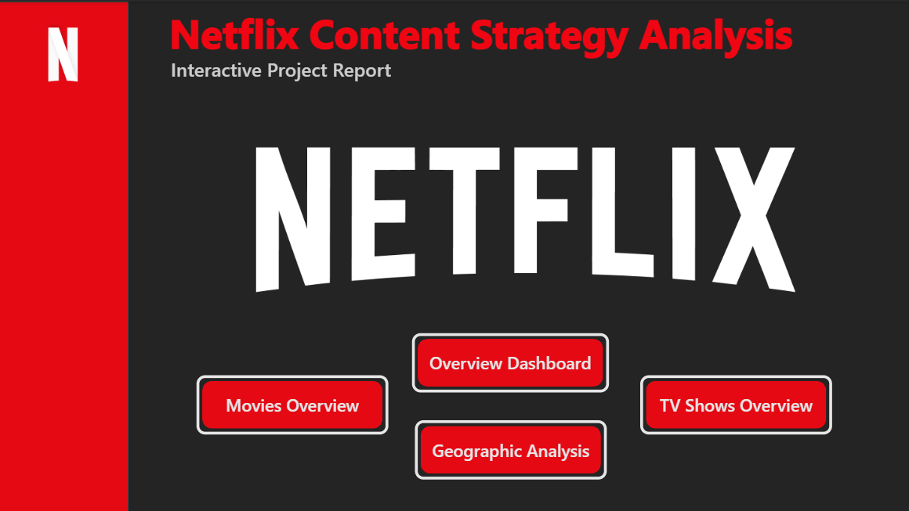
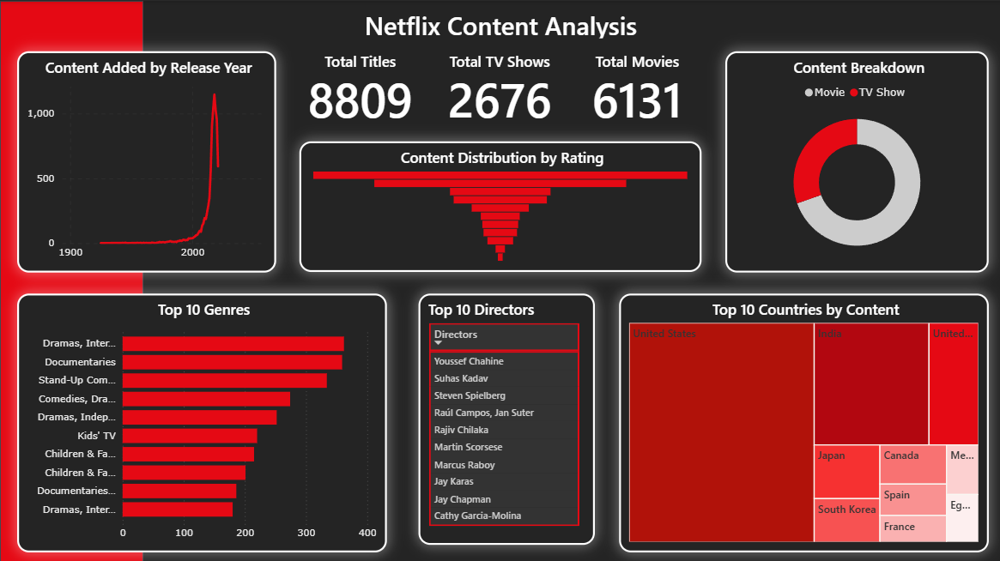
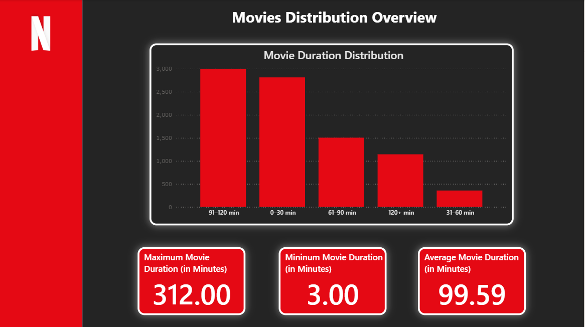
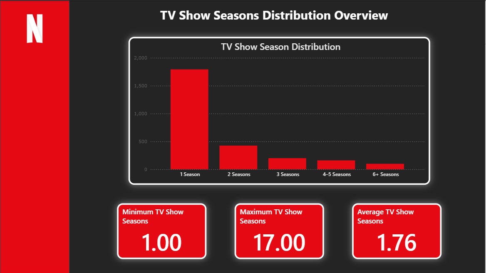
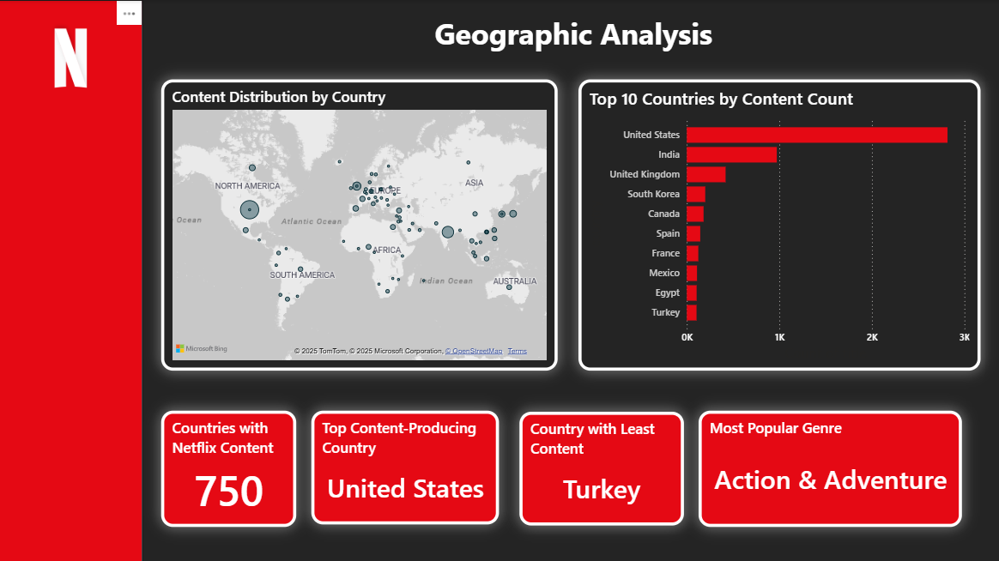

# Netflix Content Strategy Analysis (Power BI Dashboard)

This project explores Netflix’s content catalog using Power BI. It analyzes content types, release trends, most active countries, and genre distribution to help understand Netflix's global content strategy.

## Dashboard Highlights
- Total content breakdown: Movies vs. TV Shows
- Content release trend over time
- Top contributing countries
- Genre popularity and rating analysis
- TV shows and seasons distribution
 
### Screenshots

#### 1. Cover Page  

#### 2. Overview Dashboard  

#### 3. Movie Content Deep Dive  

#### 4. TV Show Content Deep Dive  

#### 5. Geographic Analysis  

## Tools Used
- Power BI
- Dataset: `netflix_titles.csv` (from Kaggle)
  
## Dataset Source
[Kaggle - Netflix Movies and TV Shows](https://www.kaggle.com/datasets/shivamb/netflix-shows)

## File
- `Netflix_Analysis.pbix` – Complete Power BI file with visuals and filters.

---

**Feel free to use this for your own learning or portfolio.**
